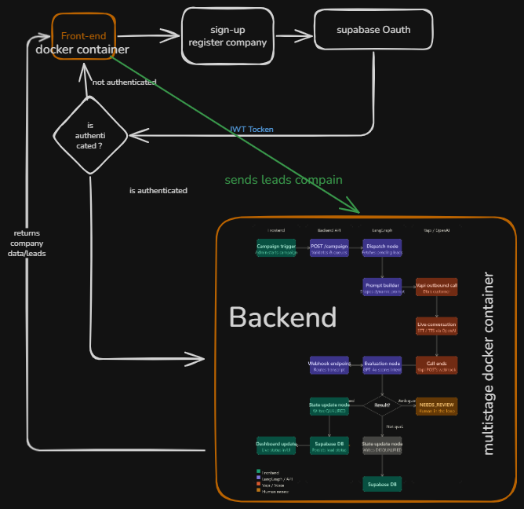

# Agentic Voice Orchestrator

A comprehensive multi-tenant SaaS platform built with a cloud-native architecture, featuring automated AI outbound calling, intelligent lead qualification, and real-time campaign management.

## 🏗️ System Architecture



The platform follows a distributed, highly scalable architecture with the following key components:

### Core Services
- **Frontend (Web):** Next.js-based dashboard interface for multi-tenant campaign management.
- **Backend API:** FastAPI REST server handling webhook routing, orchestration, and user management.
- **Orchestration Engine:** LangGraph stateful graph processing transcripts and dictating AI logic.
- **Voice Engine:** Vapi.ai integration physically dialing numbers and handling speech-to-text.
- **Database Storage:** Supabase PostgreSQL handling row-level security and data persistence.

---

## 📦 Applications

### Frontend Applications
**web:** Main SaaS dashboard frontend built with Next.js and Tailwind CSS
- Real-time lead tracking and campaign dashboard
- Multi-tenant selector and user authentication
- Live status updates (PENDING ➔ QUALIFIED)
- One-click campaign initiation interface

### Backend Services
**Backend:** Core API server built in Python
- RESTful API endpoints for campaign operations
- Secure public Webhook endpoints for real-time Vapi data
- Supabase authentication validation
- Database abstraction and ORM operations

**Orchestrator:** LangGraph Intelligence Engine
- **Dispatch Node:** Fetches leads and dynamically shapes Vapi prompts based on Company profiles.
- **Evaluation Node:** Processes raw webhook transcripts using OpenAI LLMs.
- **State Update Node:** Analyzes LLM reasoning and persistently updates lead statuses.

**Voice_Integration:** Vapi.ai Communications Hub
- Telephony routing to physical phone networks
- Low-latency conversational audio generation
- Real-time payload generation for end-of-call webhooks

---

## 📚 Core Modules

### Integration Packages
- `@core/vapi`: Voice API integration handling outbound requests and dynamic context injection.
- `@core/langgraph`: Stateful graph definitions, node schemas, and conditional routing logic.
- `@core/openai`: LLM wrapper for evaluating call transcripts and deducing customer intent.

### Utility Packages
- `@core/db`: Database abstraction layer handling secure Supabase client connections and typed SQL queries.
- `@core/config`: Centralized environment variable parsing and security management.
- `@ui/components`: Reusable React components (Shadcn) with Tailwind CSS for the frontend dashboard.

---

## 🚀 Getting Started

### Prerequisites
- Node.js 18+
- Python 3.10+
- Supabase Project (PostgreSQL)
- Vapi.ai and OpenAI API Keys
- Google Cloud SDK (for deployment)

### Installation
```bash
# Clone the repository
git clone https://github.com/your-username/agentic-voice-orchestrator.git

# Set up environment variables
cp backend/.env.example backend/.env
cp frontend/.env.example frontend/.env.local
# Edit the .env files with your configuration keys
```

### Development
```bash
# Start the Backend Service
cd backend
python -m venv venv
source venv/bin/activate
pip install -r requirements.txt
uvicorn app.main:app --reload --port 8000

# Start the Frontend Application
cd frontend
npm install
npm run dev
```

---

## 🔄 Data Flow

1. **Lead Ingestion:** Admin uploads leads into the Next.js frontend, saving them to PostgreSQL.
2. **Campaign Trigger:** Frontend dispatches a command to the Backend API to initiate calling.
3. **Dispatch & Calling:** LangGraph fetches pending leads, generates a dynamic prompt, and triggers Vapi.
4. **Execution:** Vapi places the physical phone call and converses with the customer using OpenAI.
5. **Webhook Routing:** Upon hanging up, Vapi POSTs a payload to the public Cloud Run webhook endpoint.
6. **Evaluation:** LangGraph intercepts the webhook transcript, passes it to the Evaluation Node, and determines the qualification status.
7. **Persistence & UI:** Database updates to `QUALIFIED`, and the frontend dashboard reflects the status in real-time.

---

## 🛠️ Technology Stack

- **Frontend:** Next.js 14, React, Tailwind CSS, Shadcn UI
- **Backend:** Python, FastAPI
- **Database:** Supabase (PostgreSQL with Row Level Security)
- **AI Orchestration:** LangGraph (Python)
- **Voice Telephony:** Vapi.ai REST API
- **LLM Engine:** OpenAI (GPT-4o)
- **Cloud Infrastructure:** Google Cloud Run, Cloud Build, Artifact Registry
- **Secrets Management:** GCP Secret Manager

---

## 📊 Key Features

- **Multi-Tenant Architecture:** Strict data separation allowing multiple real estate companies to operate securely.
- **Agentic Orchestration:** Intelligent transcript evaluation using LangGraph instead of rigid, hardcoded logic.
- **Automated Webhooks (Task 4):** Highly secure, unauthenticated public endpoints to ingest end-of-call data the second a call finishes.
- **Human-in-the-Loop:** Intelligent routing that flags highly ambiguous transcripts as `NEEDS_REVIEW` rather than forcing an automated guess.
- **Dynamic Prompting:** The AI persona seamlessly adapts its system prompt based on the specific tenant's business profile.

---

## 🔧 Configuration

The platform uses environment variables for security and configuration. Key settings include:
- `SUPABASE_URL` & `SUPABASE_SERVICE_ROLE_KEY`: Database connections.
- `VAPI_API_KEY`: Telephony and voice orchestration authentication.
- `OPENAI_API_KEY`: Transcript evaluation intelligence.
- `FRONTEND_URL`: CORS policies and webhook origin validations.
